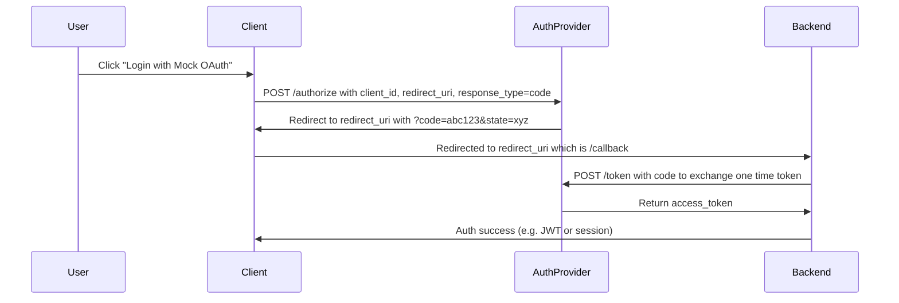

# 0auth2-dummy (Mock OAuth Flow)

This project simulates a basic OAuth 2.0 Authorization Code flow using a monorepo with 3 services:

- `client`: static site that initiates login
- `auth-provider`: mock OAuth server
- `backend`: resource server that handles token exchange and protected routes

## 🧭 OAuth Flow



---

## 📁 Project Structure

```text
0auth2-dummy/
├── packages/
│   ├── auth-provider/
│   ├── backend/
│   └── client/
├── package.json
├── .gitignore
└── README.md
```

---

## 🛠️ Setup Instructions

### 1. Clone the repo

```bash
git clone https://github.com/your-username/0auth2-dummy.git
cd 0auth2-dummy
```

### 2. Install dependencies

```bash
npm install
```

This installs dependencies for all services using npm workspaces.

### 3. Set up environment variables

Each service has a `.env` file. Copy the `.env.example` files:

```bash
cp apps/auth-provider/.env.example apps/auth-provider/.env
cp apps/backend/.env.example apps/backend/.env
cp apps/client/.env.example apps/client/.env
```

---

## 🚀 Run the Project

You can start each service in separate terminals:

```bash
# Terminal 1
npm run start --workspace=auth-provider

# Terminal 2
npm run start --workspace=backend

# Terminal 3
npm run start --workspace=client
```

Or use a single command if a root `dev` script is configured:

```bash
npm run start
```

---

## 🧪 Test the Flow

Visit the client:

```
http://localhost:3000
```

Click the “Login with Mock OAuth” button to trigger the OAuth flow.

---

## 📦 Tech Stack

* Node.js
* Express
* npm Workspaces
* dotenv